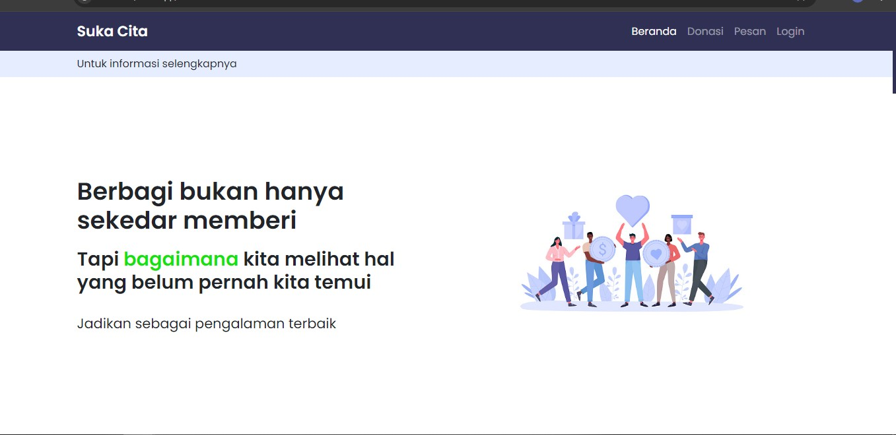

#HTML CSS browsersync
Project UAS Website Donasi-SukaCita)

## Authors

-Patrisius Remijawa
-Ni Komang Fitri Rahmadani
-I Putu Dita Windana
-Kadek Dwi Tresna Pratama
-Michael Christian Sidhartha

## Installation

Sebelum melakukan instalasi siapkan perangkat lunak :

1. Xampp / Laragon 
2. Php versi 8.0 minimal
3. VS Code

Jika menggunakan Laragon maka file disimpan di
 C:\laragon\www
Jika menggunakan Xampp maka file disimpan di
C:\xampp\htdocs

Buat data base dengan nama "donation" kemudian upload kedalam phpmyadmin
    
## Running Tests

 https://patris05.github.io/donation/

## Features

- Register
- CRUD

## Demo
localhost/donnapp

## Screenshots

